# AWS SageMaker Canvas Data Preparation Guide

I've been working with SageMaker Canvas for data prep lately, and honestly, it's pretty powerful once you get it set up right. This guide walks through everything I've learned about getting your data ready for ML models using Canvas's visual interface - no coding required.

## ⚠️ **Heads up - Canvas can get expensive fast!** ⚠️

I learned this the hard way - Canvas costs about **$1.90/hour** (as of Jan 2026, US regions). That might not sound like much, but it adds up quick if you forget to log out.

**Here's what you're paying for:**
- **Workspace time**: ~$1.90/hr just for having Canvas open
- **Model training**: Extra compute costs when building models  
- **Predictions**: Costs for running inference
- **AI services**: Additional charges if you use ready-made models

**The big gotcha**: Canvas keeps running (and billing) even if you just close your browser! I've seen people rack up hundreds in charges this way.

### How to actually stop the billing:

**The right way (do this!):**
1. Click the logout button in Canvas (left sidebar)
2. Wait for the "relaunch in different tab" message
3. Now you can close your browser safely

**Emergency stop (if you forgot to log out):**
1. Go to SageMaker Console → Domains
2. Find your domain → User profiles  
3. Click your user → Apps tab
4. Hit "Delete" next to the Canvas app
5. Confirm - billing stops immediately

**For teams/admins:**
You can set up Lambda functions to auto-shutdown idle Canvas apps. There are CloudFormation templates available that make this pretty straightforward.

**Pro tips:**
- Set up billing alerts - seriously, do this first
- Canvas charges show up as `REGION-Canvas:Session-Hrs` in your bill
- Check current pricing at [aws.amazon.com/sagemaker/canvas/pricing](https://aws.amazon.com/sagemaker/canvas/pricing/) since it changes

---

## Task 1: Setting up your SageMaker Domain

### Why you need a SageMaker Domain first

Before you can use Canvas, you need to create what AWS calls a "SageMaker Domain." Think of it like setting up a workspace - it's where all your ML stuff lives and gets managed.

Here's what the domain actually does:
- **Manages your resources**: Controls who can access what compute, storage, etc.
- **Keeps things secure**: Creates boundaries between different teams/projects  
- **Hosts your apps**: Canvas (and other SageMaker tools) need this to run
- **Handles users**: Lets you create different user profiles with different permissions
- **Stores your work**: Decides where your models, datasets, and other files go

Bottom line: No domain = no Canvas. It's just how SageMaker works.

### User profiles - why you need them too

Once you have a domain, you need user profiles. Each person gets their own profile, which gives them:
- Their own workspace (so you don't mess with each other's stuff)
- Specific permissions (maybe some people can deploy models, others can't)
- Personal settings and configurations
- Individual cost tracking (helpful for billing)

### What you need before starting

Make sure you have:
- An AWS account (obviously)
- Permissions to create SageMaker domains (check with your admin if unsure)
- Optionally: your own VPC if you're doing this for production
- An S3 bucket where Canvas can store your data

### Setting up your SageMaker Domain

Here's how to set up a custom domain with full control over permissions and settings:

1. **Start from the Domains page**
   - Go to [console.aws.amazon.com/sagemaker](https://console.aws.amazon.com/sagemaker)
   - Click "Domains" in the left sidebar
   - Click "Create domain"

2. **Choose custom setup**
   - Select "Custom setup" for advanced options
   - You'll get way more configuration choices

3. **Basic domain config**
   - Give it a name that makes sense
   - **Authentication method**: Select "IAM" (this is what we're using)
   - Pick your VPC and subnets (or use defaults)
   - Set up encryption if you need it

4. **Pick your Canvas permissions**
   - You can select up to 8 "ML activities" total
   - **Must have**: "Run Studio Applications" and "Canvas Core Access"
   - **For data prep**: "Canvas Data Preparation" (that's why we're here!)
   - **Optional stuff**: AI Services, MLOps, Kendra access

5. **Storage settings**
   - **System managed**: AWS creates an S3 bucket for you
   - **Customer managed**: Use your own S3 bucket

### Creating your user profile

After the domain is ready:

1. **Go to your domain**
   - SageMaker Console → Domains → click your domain name

2. **Add a user**
   - Click "Add user"
   - Pick a username
   - **Execution role**: Select the default "AmazonSageMaker-ExecutionRole-*" that already exists in your account (this has all the permissions you need)

3. **Set permissions**
   - Usually just inherit from the domain settings
   - Customize if you need different access levels

### What Canvas actually needs to work

**The essentials:**
- Core Canvas access (obviously)
- Data preparation permissions (for the data wrangling we want to do)
- S3 access (where your data lives)
- Basic networking setup

**Nice to have:**
- AI Services (for ready-made models)
- MLOps features (if you want to deploy models later)
- Database connectors (Redshift, RDS, etc.)

### Testing everything works

Once you're set up:

1. **Try launching Canvas**
   - Go to SageMaker Console → Canvas
   - Click "Open Canvas" next to your user
   - Should launch in a new tab

2. **Quick permission check**
   - See if you can access the data import features
   - Try creating a new dataset
   - Make sure you can see the transformation tools

3. **Set up cost monitoring** (seriously, do this)
   - Turn on AWS Cost Explorer
   - Create billing alerts
   - Add cost tags if you're sharing the account

### When things go wrong

**Domain won't create:**
- Check your IAM permissions
- Make sure your VPC/subnet setup is valid
- Verify Canvas is available in your region

**Canvas won't launch:**
- Double-check the user profile has Canvas permissions
- Make sure the execution role has the right policies
- Confirm domain status shows "InService"

**Surprise billing:**
- If Canvas is still running, force-stop it via the console
- Set up auto-shutdown (Lambda functions work great)
- Use Cost Explorer to see where charges are coming from

**Canvas keeps billing after closing browser:**
This is the most common mistake! Canvas doesn't stop when you close the browser.
- **Fix**: Go to Console → Domains → Your Domain → User Profiles → Apps → Delete the Canvas app
- **Prevent**: Always use the logout button in Canvas first

### What's next

Once your domain and user are working:
- Task 2: Getting your data into Canvas
- Task 3: Checking data quality  
- Task 4: Transforming and cleaning data
- Task 5: Exporting your final dataset

---

**Remember: Canvas costs $1.90/hour even when you're not actively using it. Always log out properly!**

## Task 2: Getting your data into Canvas with Data Wrangler

### What is Data Wrangler?

Data Wrangler is basically Canvas's built-in data prep tool - think of it as your visual data cleaning assistant. Instead of writing code to clean and transform your data, you get a drag-and-drop interface where you can:

- Import data from various sources (S3, databases, etc.)
- See what your data looks like with automatic profiling
- Clean up messy data with point-and-click transformations
- Create a visual "flow" that shows exactly what you did to your data
- Export the cleaned data for model training

The cool thing is that Data Wrangler creates a visual pipeline of all your data prep steps, so you can see exactly what happened to your data and easily reproduce it later.

### Importing CSV data from S3

For this task, I'm assuming you already have a CSV file sitting in an S3 bucket. If you don't, just upload one through the S3 console first.

Here's how to get your data from S3 into Canvas for cleaning:

1. **Launch Canvas and find Data Wrangler**
   - Open Canvas from your SageMaker console (like we did in Task 1)
   - On the Canvas home page, look for "Import and prepare" 
   - Click on it - this launches Data Wrangler

2. **Start a new data flow**
   - You'll see the Data Wrangler interface open up
   - It might take a minute or two to load the first time
   - You should see a "Create data flow" option or it might start automatically
   - **Name your data flow**: Change the default name to "VijayDataPrepPoC" so it's easy to find later

3. **Connect to your S3 data**
   - Look for "Import data" or a similar button
   - Choose "Amazon S3" as your data source
   - You'll see a file browser showing your S3 buckets

4. **Navigate to your CSV file**
   - Browse through your S3 buckets to find your CSV file
   - Click on the bucket name, then navigate through folders if needed
   - When you find your CSV file, click on it

5. **Preview and configure the import**
   - Data Wrangler will show you a preview of your CSV
   - Check if the column headers look right
   - Make sure the data types look reasonable (it auto-detects them)
   - You can adjust settings like:
     - Whether the first row contains headers
     - What delimiter is used (comma, semicolon, etc.)
     - How to handle missing values

6. **Import the data**
   - Once the preview looks good, click "Import" or "Create dataset"
   - Data Wrangler will pull in your data and create the first step in your data flow
   - You'll see your dataset appear as a node in the visual flow

### What happens after import

Once your data is imported, Data Wrangler automatically:
- **Analyzes your data**: Shows you statistics, missing values, data distributions
- **Infers data types**: Tries to figure out if columns are numbers, text, dates, etc.
- **Creates a data flow**: Your import becomes the first step in a visual pipeline

You'll see something like a flowchart with your imported dataset as the starting point. From here, you can add transformation steps, analyze data quality, and prepare your data for ML.
## Task 3: Checking your data quality

Now that we've got our data imported into Data Wrangler, it's time to actually look at what we're working with. This is probably the most important step - you can't build good models with bad data, so we need to understand what issues we're dealing with.

### 3a: Quick data validation using the Data tab

First, let's do a basic sanity check of our data:

1. **Look at the Data tab**
   - In your Data Wrangler flow, you should see your imported dataset as a node
   - Click on that node to select it
   - Look for a "Data" tab (usually at the bottom or side of the interface)
   - Click on it to see your actual data

2. **Scan through your data**
   - This shows you the raw data in a table format
   - Scroll through a few rows to get a feel for what you're working with
   - Look for obvious issues like:
     - Columns that are completely empty
     - Weird characters or formatting issues
     - Data that doesn't look right (like negative ages or impossible dates)
     - Missing values showing up as blanks, "NULL", "N/A", etc.

3. **Check the column headers**
   - Make sure all your expected columns are there
   - Verify the column names make sense
   - Look at the data types (usually shown at the top of each column)

This gives you a quick gut check - does the data look roughly like what you expected?

### 3b: Deep dive with Data Quality and Insights Report

Now for the real analysis. Data Wrangler has a built-in tool that automatically analyzes your data and spots issues:

1. **Start the analysis**
   - Right-click on your dataset node (or look for a "+" or ellipsis icon next to it)
   - Choose "Get data insights" or "Add analysis"
   - You'll see analysis options appear

2. **Create the Data Quality and Insights Report**
   - For "Analysis type", select **"Data Quality and Insights Report"**
   - Give it a name: **"VijayPoCDataQualityAndInsights"**
   - For "Target column", select **"Income"**
   
   **What's a target column in AI?** Think of it as the "answer" you want your AI model to predict. In machine learning, we use historical data to teach the computer to make predictions. The target column (also called the "label" or "dependent variable") is what we're trying to predict based on all the other columns (called "features").
   
   For example:
   - If you want to predict house prices, "Price" would be your target column
   - If you want to predict if an email is spam, "IsSpam" would be your target
   - In our case, we're using "Income" as the target - so we're building a model that can predict someone's income based on their other characteristics
   
   The target column helps Data Wrangler understand which column is most important and analyze how well the other columns can help predict it.

   - For "Problem type", choose either:
     - **Regression** if you're trying to predict a number (like price, temperature, etc.)
     - **Classification** if you're trying to predict categories (like yes/no, spam/not spam, etc.)
   
   **Quick rule**: If your target column data type is "String", choose **Classification**. If it's "Number", choose **Regression**.
   
   **For our Income example**: Since our Income column contains categories ("<=50K" or ">50K") rather than actual dollar amounts, we should select **"Classification"**. Even though we're dealing with income, the data is formatted as categories, not continuous numbers.

3. **Choose your data size**
   - Select **"Sampled dataset"** (this is the recommended default)
   - **Sampled dataset**: Uses up to 200,000 rows (faster, good for initial exploration)
   - **Full dataset**: Analyzes everything (slower, but more complete - costs extra compute time)
   - For most cases, "Sampled dataset" is perfect to start with

5. **Run the analysis**
   - Click "Create" and wait for it to finish
   - This usually takes a few minutes depending on your data size
   
   **⚠️ ERROR**: Sometimes you might get an error like **"Something went wrongOperatorCustomerError"**. This often happens when you select the wrong problem type - for example, choosing "Regression" when your target column contains categories instead of numbers. If you get this error, try switching between "Regression" and "Classification" to see which one works with your data.
   
   **Problem Type Tip**: If you get errors with "Regression" but "Classification" works, check your target column's data type. In our case, Income contains categories ("<=50K", ">50K") rather than actual numbers, so Classification is the right choice even though we're dealing with income data.

### What the report tells you

Once it's done, you'll get a comprehensive report that shows:

**Summary section:**
- How many missing values you have
- Number of outliers (weird extreme values)
- Data types for each column
- Overall data quality score

**Target analysis (if you picked a target):**
- How balanced your target variable is
- Distribution of values you're trying to predict
- Potential issues with your target

**Feature insights:**
- Which columns are most useful for prediction
- Columns that might be causing problems
- Recommendations for data cleaning

**Quick model results:**
- A rough estimate of how well a model might perform on this data
- Helps you understand if your data is even suitable for ML

---

## Task 4: Understanding the Data Quality and Insights Report

After you've generated the Data Quality and Insights Report in Task 3, you'll see a comprehensive analysis of your dataset. This report is packed with information, and understanding what it's telling you is crucial for making good decisions about how to clean and prepare your data.

The report is organized into several key sections, each providing different insights about your data. In the next task, we'll dive deep into what each section means and how to interpret the results.

---

## Task 5: Analyzing the Data Quality Report

Now let's break down what the Data Quality and Insights Report is actually telling you. This report has several sections, each giving you different perspectives on your data quality.

### 5a: Summary Statistics - The Big Picture

The Summary Statistics section gives you a high-level overview of your entire dataset. Think of this as the "executive summary" - it tells you the most important facts about your data at a glance.

**What you'll see here:**

**Dataset Overview:**
- **Number of features (columns)**: How many variables you're working with
- **Number of rows**: Total records in your dataset
- **Missing cells**: How many data points are blank or null
- **Valid rows**: Rows that have complete data
- **Duplicate rows**: Identical records that might need to be removed

**Feature Details:**
For each column in your dataset, you'll see:
- **Data type**: Whether it's numeric, categorical (text), date/time, etc.
- **Missing values**: How many blanks in this specific column
- **Unique values**: How many distinct values exist
- **Most common value**: What appears most frequently

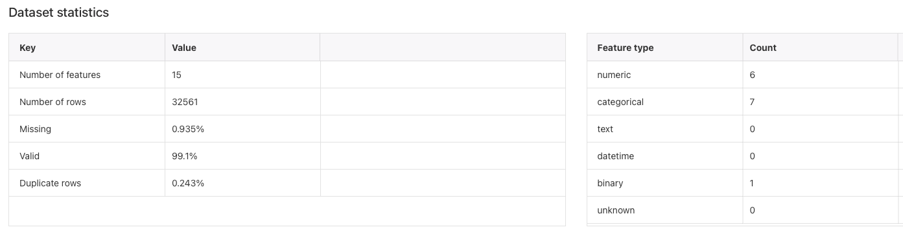

**What to look for:**
- **High missing percentages**: If a column is missing more than 30-40% of its data, you might want to drop it entirely
- **Duplicate rows**: These can skew your model - usually you want to remove them
- **Columns with only one unique value**: These don't provide any information and should be removed
- **Data type mismatches**: Sometimes numbers get imported as text, or dates as strings - you'll need to fix these

### 5b: Feature Summary - Getting to Know Your Columns

Alright, this is where things get interesting. The Feature Summary section breaks down each column in your dataset and tells you what's actually going on with it. I find this section super helpful because it saves you from having to manually inspect every single column.

### 5c: Duplicate Rows - Finding the Copycats

This section is pretty straightforward but super important. Duplicate rows are basically identical records that appear more than once in your dataset, and they can really mess up your model training.

### 5d: Anomalous Samples - The Weird Stuff

This is one of my favorite sections because it's like having a detective automatically find the suspicious records in your data. Anomalous samples are rows that look really different from everything else - they're the outliers, the oddities, the "wait, that doesn't make sense" records.

### 5e: Target Column - Understanding What You're Predicting

The Target Column section shows you detailed information about the column you're trying to predict (the one you selected when creating the report). This is super important because if your target column has issues - like being heavily imbalanced (99% one value, 1% another), having too many missing values, or containing weird outliers - your model is going to struggle no matter how good your other data is. The report will show you the distribution of values in your target, flag any imbalance issues, and help you understand if you have enough examples of each category (for classification) or a reasonable range of values (for regression) to actually train a useful model.

### 5f: Quick Model - A Sneak Peek at Performance

Here's where Data Wrangler gets really cool - it actually trains a quick, basic model on your data and shows you how well it performs. This isn't meant to be your final production model, but it gives you a reality check on whether your data is even good enough to build something useful. You'll see metrics like accuracy (for classification) or error rates (for regression), and honestly, if this quick model performs terribly, it's a sign you need to do more data cleaning or maybe rethink your approach. On the flip side, if it does surprisingly well, that's a good indicator you're on the right track and your data quality is solid enough to move forward.

### 5g: Feature Summary - Which Columns Actually Matter

The Feature Summary section ranks all your columns by how useful they are for predicting your target. This is super helpful because not all features are created equal - some columns might be incredibly predictive while others are just noise. You'll see an importance score for each feature, and this helps you figure out which columns to focus on, which ones you might be able to drop, and which relationships are worth investigating further. I always look at this section to see if the important features make sense - if something random like "customer ID" shows up as highly important, that's usually a red flag that something's wrong with your data.

### 5h: Feature Details - The Deep Dive

Feature Details is where you can click into any specific column and get a really detailed breakdown of what's going on with it. You'll see histograms, statistics, correlations with your target column, and specific issues like outliers or unusual patterns. This is where I spend time when something looks off in the other sections - like if a feature has unexpectedly high importance or if I'm seeing weird patterns in my model results. It's basically a magnifying glass for each column, letting you understand exactly what values exist, how they're distributed, and whether there are any problems you need to fix before training your real model.

---

## Task 6: Target Label Classification Analysis

Now that we've reviewed the overall data quality report, let's dig deeper into our target variable - the "Income" column. Understanding how your target variable is distributed is crucial before you start building models. This analysis helps us see if our data is balanced or if we have issues that could cause our model to perform poorly.

**Why analyzing the target distribution matters:**

1. **Detect imbalances**: If 95% of your data is one class and only 5% is another, your model might just predict the majority class all the time and still look "accurate"
2. **Understand target variable**: See the actual breakdown of what you're trying to predict
3. **Feature Engineering**: Identify skewed distributions that might need special handling or transformation
4. **Avoid Model Mistakes**: Catch heavily imbalanced or biased data before wasting time training models that won't work

### Creating a Histogram to Visualize Income Distribution

Let's create a histogram that shows how income is distributed across different demographics in our dataset. This will help us spot any imbalances or patterns.

**Steps to create the histogram:**

1. **Go to the Analyses tab**
   - In your Data Wrangler flow, look for the "Analyses" tab
   - Click on the "+" button to add a new analysis

2. **Create the analysis**
   - Click "Create Analysis"
   - For "Analysis type", select **"Histogram"**
   - Give it a name: **"VijayTargetColumnHistogram"**

3. **Configure the histogram**
   - **X axis**: Select **"Income"** (this is our target variable)
   - **Color By**: Select **"Race"** (this will show different colors for different races)
   - **Facet By**: Select **"sex"** (this will create separate charts for male and female)

4. **Review the results**
   - Click "Create" and wait for the histogram to generate
   - You'll see the distribution of income levels broken down by race and sex

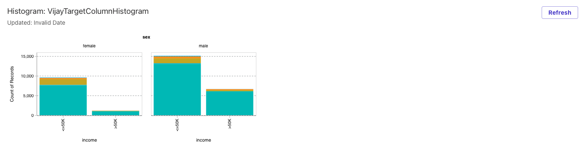

---

## Task 7: Analyzing Target Leakage

**What is target leakage?**

Imagine you are trying to predict whether a student will pass an exam. You have lots of information about the student: age, study hours, previous grades. But then, you accidentally include the exam score itself in the training data. That's target leakage — the model is learning from something it wouldn't know in real life.

**Why it's a problem:**

- Model looks amazing on training data → high accuracy
- Model fails in production, because the leaked feature isn't available
- Creates false confidence

### Running a Target Leakage Analysis

Data Wrangler has a built-in tool to help detect potential leakage in your dataset. Here's how to use it:

**Steps to check for target leakage:**

1. **Go to the Analyses tab**
   - In your Data Wrangler flow, click on the "Analyses" tab
   - Click the "+" button to add a new analysis

2. **Create the leakage analysis**
   - Click "Create Analysis"
   - For "Analysis Type", select **"Target Leakage"**
   - Give it a name: **"VijayTargetColumnLeakage"**

3. **Configure the analysis**
   - **Max Features**: Set to **15** (this limits how many features to analyze)
   - **Problem Type**: Select **"Classification"**
   - **Target**: Select **"Income"**

4. **Review the results**
   - Click "Create" and wait for the analysis to complete
   - The report will show you which features might be leaking information about your target
   - Look for features with suspiciously high predictive power (like 99%+ correlation)

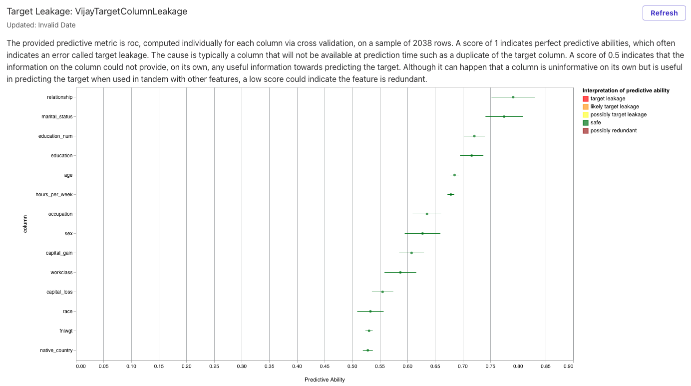

### Understanding ROC Scores

**What is ROC?**

ROC (Receiver Operating Characteristic) is basically a score that tells you how good a feature is at predicting your target variable. ROC value ranges from 0 to 1.

**How to interpret the scores:**

The provided predictive metric is ROC, computed individually for each column via cross validation, on a sample of 2038 rows. A score of 1 indicates perfect predictive abilities, which often indicates an error called target leakage. The cause is typically a column that will not be available at prediction time such as a duplicate of the target column. A score of 0.5 indicates that the information on the column could not provide, on its own, any useful information towards predicting the target. Although it can happen that a column is uninformative on its own but is useful in predicting the target when used in tandem with other features, a low score could indicate the feature is redundant.

---

## Task 8: Drop Unnecessary Columns

Based on our target leakage analysis, we found that some columns have a ROC score of 0.5, which means they don't provide any useful information for predicting our target. Specifically, "native_country" and "fnlwgt" aren't helping our model at all, so we should remove them to simplify our dataset and potentially improve model performance.

**Why drop these columns?**

Keeping useless features in your dataset can actually hurt your model:
- They add noise without adding value
- They increase training time
- They can confuse the model and reduce accuracy
- They make your data harder to work with

### Steps to Drop Columns

1. **Go to the Data tab**
   - In your Data Wrangler flow, click on the "Data" tab
   - This shows your current dataset

2. **Add a transformation**
   - Click "Add transform" (usually a "+" button)
   - This opens the transformation menu

3. **Select Manage Columns**
   - Look for "Manage Columns" in the transformation options
   - Click on it to see column management options

4. **Drop the columns**
   - Select "Drop columns" or similar option
   - For "Columns to Drop", select:
     - **fnlwgt**
     - **native_country**
   - Click "Add" to apply the transformation

5. **Verify the changes**
   - Check that the columns are no longer visible in your dataset
   - Your data flow should now show this transformation as a new step

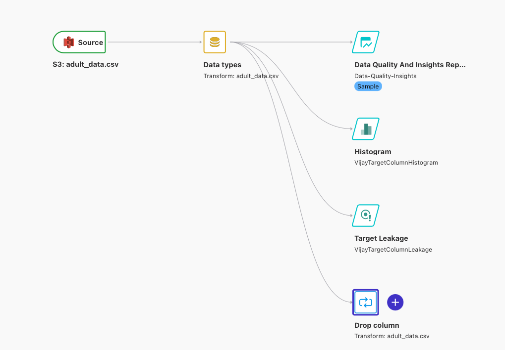

Now your dataset is cleaner and only contains features that actually contribute to predicting income!

---

## Task 9: Handle Missing Values

From the Feature Summary analysis, we discovered that two important features have missing values: "Occupation" has 5.66% missing values and "Workclass" has 5.64% missing values. While these percentages aren't huge, missing values can cause problems for machine learning models, so we need to deal with them.

**Why handle missing values?**

- Most ML algorithms can't work with missing data
- Missing values can introduce bias into your model
- They reduce the amount of usable data for training
- They can lead to incorrect predictions

**Our approach:** Since the percentage of missing values is relatively small (under 6%), we'll simply drop the rows that have missing values in these columns. This is a safe approach when you're not losing too much data.

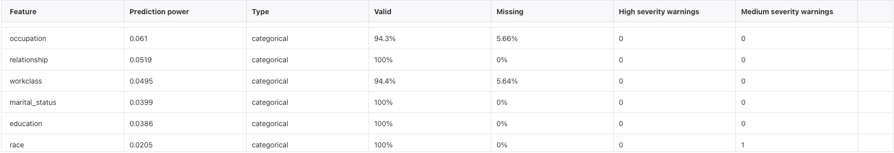

### Steps to Drop Missing Values

1. **Go to the Data tab**
   - In your Data Wrangler flow, click on the "Data" tab

2. **Add a transformation**
   - Click "Add Transform"

3. **Select Handle Missing**
   - Look for "Handle Missing" in the transformation options
   - Click on it

4. **Configure the transformation**
   - For "Transform", select **"Drop Missing"**
   - For "Input columns", select:
     - **Occupation**
     - **Workclass**
   - Click "Add" to apply the transformation

5. **Verify the changes**
   - Check your dataset row count - it should be slightly smaller now
   - The remaining rows should have no missing values in Occupation or Workclass

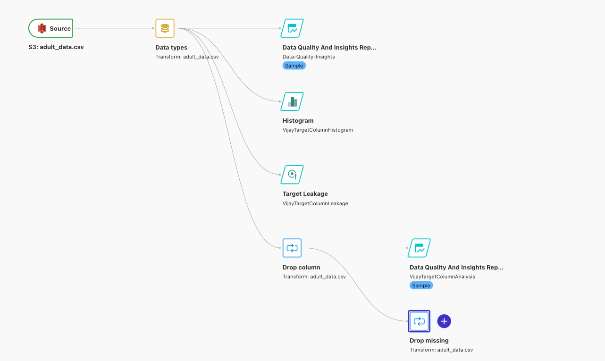

Now your dataset is complete with no missing values in these critical features, making it ready for model training!

---

## Task 10: Drop Duplicate Records

As we saw earlier in the Data Quality report, our dataset contains duplicate rows - identical records that appear more than once. Duplicates can skew your model's training by making it think certain patterns are more common than they actually are. Let's remove them to ensure each unique record appears only once.

**Why remove duplicates?**

- Prevents the model from overweighting certain patterns
- Reduces dataset size without losing unique information
- Improves model generalization
- Avoids bias toward duplicated examples

### Steps to Drop Duplicates

1. **Go to the Data tab**
   - In your Data Wrangler flow, click on the "Data" tab

2. **Add a transformation**
   - Click "Add Transform"

3. **Select Drop Rows**
   - Look for "Drop Rows" in the transformation options
   - Click on it

4. **Configure the transformation**
   - For "Transform", select **"Drop Duplicates"**
   - Click "Add" to apply the transformation

5. **Verify the changes**
   - Check your dataset row count - it should be smaller if duplicates were found
   - Each row in your dataset should now be unique

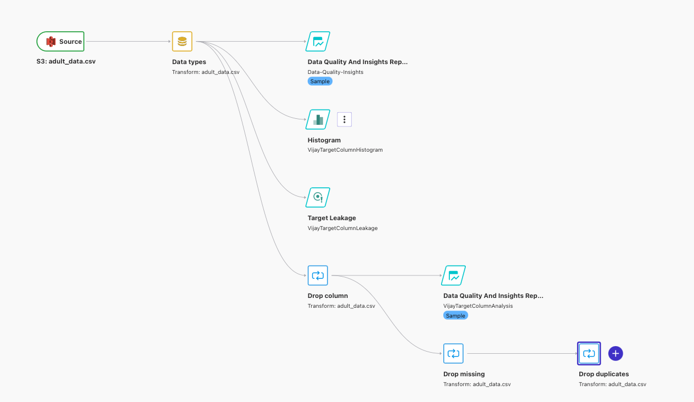

Your dataset is now clean, with no duplicate records cluttering your data!

---

## Task 11: Strip Spaces from String Features

Text data often has extra spaces at the beginning or end of values - like " Manager" instead of "Manager" or "Sales ". These leading and trailing spaces can cause problems because the model treats " Manager" and "Manager" as completely different values, even though they mean the same thing. Let's clean this up by stripping spaces from all our string-type features.

**Why strip spaces?**

- Ensures consistent formatting across all text values
- Prevents the model from treating identical values as different
- Reduces the number of unique categories in categorical features
- Improves data quality and model accuracy

### Steps to Strip Spaces

1. **Go to the Data tab**
   - In your Data Wrangler flow, click on the "Data" tab

2. **Add a transformation**
   - Click "Add Transform"

3. **Select Format String**
   - Look for "Format String" in the transformation options
   - Click on it

4. **Configure the transformation**
   - For "Transform", select **"Strip left and right"**
   - For "Input columns", select all 8 features of "string" type:
     - workclass
     - education
     - marital-status
     - occupation
     - relationship
     - race
     - sex
     - income
   - For "Characters to remove", press the **space bar** (enter a single space)
   - Click "Add" to apply the transformation

5. **Verify the changes**
   - Check a few string columns to confirm spaces are removed
   - Values should now be consistently formatted without leading/trailing spaces

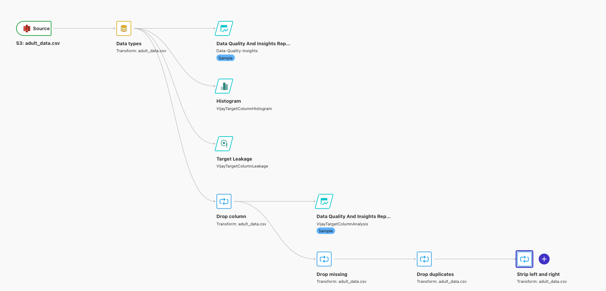

Your text data is now clean and consistently formatted!

---

## Task 12: Transform Target Column to Binary Values

Right now, our target column "income" contains text values like "<=50K" and ">50K". Machine learning models work much better with numbers than with strings, so we need to convert these text categories into numeric values. We'll transform "<=50K" to 1 (positive class) and ">50K" to 0 (negative class).

**Why convert to numbers?**

Models understand numbers better than strings like "<=50K" or ">50K". By converting to binary values (0 and 1), we make it easier for the model to learn patterns and make predictions.

### 12a: Transform "<=50K" to 1

First, let's convert all instances of "<=50K" to the number 1.

**Steps:**

1. **Go to the Data tab**
   - In your Data Wrangler flow, click on the "Data" tab

2. **Add a transformation**
   - Click "Add Transform"

3. **Select Format String**
   - Look for "Format String" in the transformation options
   - Click on it

4. **Configure the transformation**
   - For "Transform", select **"Search and Edit"**
   - For "Input Columns", select **"income"**
   - For "Pattern", enter **"<=50K"**
   - For "Replacement String", enter **"1"**
   - Click "Add" to apply the transformation

### 12b: Transform ">50K" to 0

Now, let's convert all instances of ">50K" to the number 0.

**Steps:**

1. **Add another transformation**
   - Click "Add Transform" again

2. **Select Format String**
   - Look for "Format String" in the transformation options
   - Click on it

3. **Configure the transformation**
   - For "Transform", select **"Search and Edit"**
   - For "Input Columns", select **"income"**
   - For "Pattern", enter **">50K"**
   - For "Replacement String", enter **"0"**
   - Click "Add" to apply the transformation

4. **Verify the changes**
   - Check the income column - it should now contain only 1s and 0s
   - 1 represents people earning <=50K
   - 0 represents people earning >50K

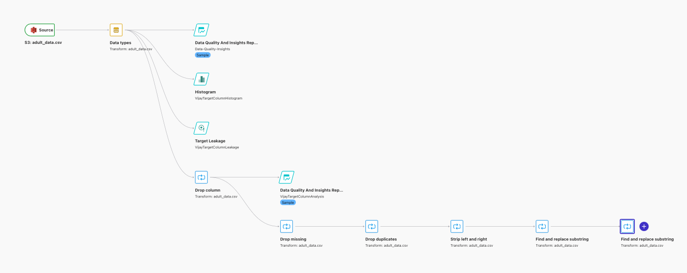

Your target column is now in the perfect format for model training!

---

## Task 13: Remove Outliers from Capital Gain

From the Feature Details analysis, we discovered that the "capital_gain" feature has approximately 3.06% outliers - extreme values that are way outside the normal range. Outliers can throw off your model's predictions by making it think these extreme cases are more common than they actually are. Let's remove these outliers to improve data quality.

**Why remove outliers?**

- Prevents the model from being skewed by extreme values
- Improves model accuracy on typical cases
- Reduces noise in the training data
- Helps the model learn more generalizable patterns

### Steps to Remove Outliers

1. **Go to the Data tab**
   - In your Data Wrangler flow, click on the "Data" tab

2. **Add a transformation**
   - Click "Add Transform"

3. **Select Handle Outliers**
   - Look for "Handle Outliers" in the transformation options
   - Click on it

4. **Configure the transformation**
   - For "Transform", select **"min-max numeric outliers"**
   - For "Input columns", select **"capital_gain"**
   - Click on **"Advanced"** to see more options
   - For "Fix Method", select **"Remove"**
   - For "Upper Threshold", enter **"80000"**
   - For "Lower Threshold", enter **"0"**
   - Click "Add" to apply the transformation

5. **Verify the changes**
   - Check your dataset row count - it should be slightly smaller
   - The capital_gain column should now only contain values between 0 and 80,000
   - Extreme outliers have been removed

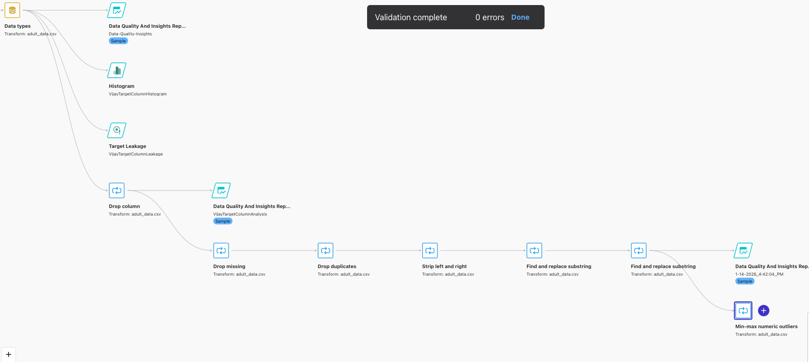

Your dataset is now free from extreme outliers that could confuse the model!
Your dataset is now free from extreme outliers that could confuse the model!

---

## Task 14: Ordinal Encoding

Now we need to convert some of our categorical (text) features into numbers so the machine learning model can work with them. Ordinal encoding is the process of converting categories into numbers based on their natural order.

**What is Ordinal Encoding?**

Ordinal encoding is the process of converting categories into numbers based on order. For example, education levels have a natural progression: "High School" < "Bachelors" < "Masters" < "Doctorate". Ordinal encoding preserves this meaningful order by assigning numbers like 1, 2, 3, 4.

**Why use Ordinal Encoding?**

We use ordinal encoding because ML models cannot do math on strings, and ordinal encoding preserves meaningful order when that order exists. Features like education and occupation have inherent rankings that we want to maintain in our numeric representation.

### Steps to Apply Ordinal Encoding

1. **Go to the Data tab**
   - In your Data Wrangler flow, click on the "Data" tab

2. **Add a transformation**
   - Click "Add Transform"

3. **Select Encode Categorical**
   - Look for "Encode Categorical" in the transformation options
   - Click on it

4. **Configure the transformation**
   - For "Transform", select **"Ordinal Encode"**
   - For "Input Columns", select:
     - **education**
     - **education_num**
     - **occupation**
   - Click on **"Advanced"** to see more options
   - For "Invalid Handling Strategy", select **"skip"**
   - Click "Add" to apply the transformation

5. **Verify the changes**
   - Check the selected columns - they should now contain numeric values instead of text
   - The numeric values will preserve the natural ordering of the categories
   - For example, "Bachelors" might become 2, "Masters" might become 3, etc.

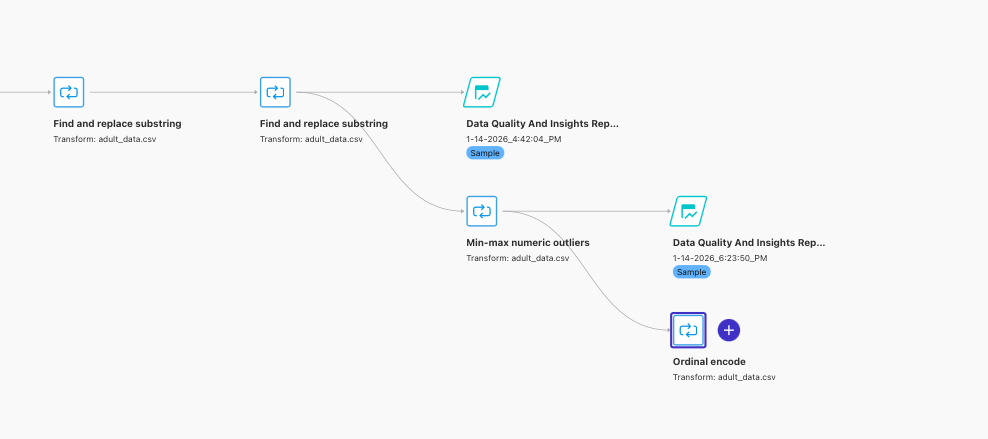

Your categorical features are now encoded as numbers while preserving their meaningful order!

---

## Task 15: One-Hot Encoding

Now we need to handle another type of categorical feature - ones that don't have a natural order. For these, we'll use one-hot encoding, which is different from the ordinal encoding we just did.

**What is One-Hot Encoding?**

One-hot encoding converts a categorical feature into multiple binary 0/1 columns, one per category.

For example, the "sex" feature:
```
sex
----
Male
Female
```

Gets converted to:
```
sex_male   sex_female
1          0
0          1
```

**Why do we need one-hot encoding?**

ML models cannot understand strings. But why can't we just use numbers like we did with ordinal encoding? If we assign "Male: 1", "Female: 0", the ML model might assume a fake ordering where "Male" is greater than "Female". This introduces bias into the model.

**When should we use One-Hot Encoding?**

Generally used for features of type "Nominal" - categories that don't have a natural order, like "sex", "race", "country", "color".

**Why is it called "One-Hot"?**

Think of it like indicator lights. For example:
```
Red = 1
Yellow = 2
Green = 3
```

We don't want to tell the model "I picked Blue = 2". Instead, we ask:
```
Is Red?    Is Yellow?    Is Green?
1          0             0
```

Only one of the options is "1" (hot/on), so it's called "One-Hot" encoding!

### Steps to Apply One-Hot Encoding

1. **Go to the Data tab**
   - In your Data Wrangler flow, click on the "Data" tab

2. **Add a transformation**
   - Click "Add Transform"

3. **Select Encode Categorical**
   - Look for "Encode Categorical" in the transformation options
   - Click on it

4. **Configure the transformation**
   - For "Transform", select **"One-hot Encode"**
   - For "Input Columns", select:
     - **marital_status**
     - **race**
     - **relationship**
     - **sex**
     - **workclass**
   - Click on **"Advanced"** to see more options
   - For "Invalid Handling Strategy", select **"skip"**
   - For "Output Style", select **"Columns"**
   - Click "Add" to apply the transformation

5. **Verify the changes**
   - Your dataset should now have many more columns
   - Each original categorical column has been replaced with multiple binary columns
   - For example, "sex" becomes "sex_male" and "sex_female"
   - Each row will have a 1 in exactly one column per original feature

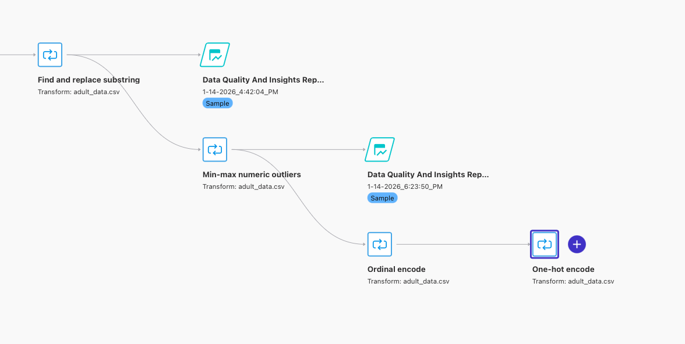

Your nominal categorical features are now properly encoded without introducing false ordering!

---

## Task 16: Move Target Column to First Position

Some machine learning algorithms, like XGBoost (which we'll use for training), require the target column to be in the first position. Let's move our "income" column to the start of the dataset.

**What is XGBoost?**

XGBoost is an algorithm which is used to train the model. It's like a "recipe" and a model is the result after cooking.

XGBoost (Extreme Gradient Boosting) is a powerful machine learning algorithm that builds many small decision trees sequentially, where each new tree focuses on correcting the mistakes of the previous ones.

**Why are we using XGBoost?**

XGBoost is used because it:
- Works extremely well on tabular data
- Handles non-linear relationships
- Works with mixed data types
- Handles missing values

**What kind of problems is XGBoost good for?**
- Classification
- Regression
- Tabular Data

**What are other Common ML Algorithms?**

🔹 **Linear Models**

| Algorithm | Use case |
|-----------|----------|
| Linear Regression | Predict continuous values |
| Logistic Regression | Binary classification |

🔹 **Tree-Based Models**

| Algorithm | Description |
|-----------|-------------|
| Decision Tree | Single tree |
| Random Forest | Many independent trees |
| XGBoost | Boosted trees (sequential) |
| LightGBM | Faster gradient boosting |
| CatBoost | Handles categorical data well |

🔹 **Distance-Based Models**

| Algorithm | Use case |
|-----------|----------|
| KNN | Similarity-based prediction |

🔹 **Probabilistic Models**

| Algorithm | Use case |
|-----------|----------|
| Naive Bayes | Text classification |

🔹 **Neural Networks (Deep Learning)**

| Algorithm | Use case |
|-----------|----------|
| ANN | General ML |
| CNN | Images |
| RNN / LSTM | Sequences |
| Transformers | LLMs |

### Steps to Move Target Column

1. **Go to the Data tab**
   - In your Data Wrangler flow, click on the "Data" tab

2. **Add a transformation**
   - Click "Add Transform"

3. **Select Manage Columns**
   - Look for "Manage Columns" in the transformation options
   - Click on it

4. **Configure the transformation**
   - For "Transform", select **"Move Column"**
   - For "Move type", select **"Move to Start"**
   - For "Column to move", select **"income"**
   - Click "Add" to apply the transformation

5. **Verify the changes**
   - Check your dataset - the "income" column should now be the first column
   - All other columns should remain in their original order


Your dataset is now properly formatted for XGBoost training!

---

## Task 17: Split Data into Train, Test, and Validation Sets

Now that our data is fully cleaned and prepared, we need to split it into three separate datasets: Train, Test, and Validation. This is a crucial step in machine learning to ensure our model learns properly and we can evaluate its performance accurately.

**Why split the data?**

- **Train set (70%)**: Used to teach the model patterns in the data
- **Test set (20%)**: Used to evaluate how well the model performs on unseen data
- **Validation set (10%)**: Used during training to tune the model and prevent overfitting

Think of it like studying for an exam: you practice with homework (train), check your understanding with practice tests (validation), and then take the final exam (test).

### Steps to Split the Data

1. **Go to the Data tab**
   - In your Data Wrangler flow, click on the "Data" tab

2. **Add a transformation**
   - Click "Add Transform"

3. **Select Split Data**
   - Look for "Split Data" in the transformation options
   - Click on it

4. **Configure the transformation**
   - For "Transform", select **"Randomized Split"**
   - Configure the splits:
     - **Split 1**:
       - Name: **Train**
       - Split Percentage: **0.7** (70%)
     - **Split 2**:
       - Name: **Test**
       - Split Percentage: **0.2** (20%)
     - **Split 3**:
       - Name: **Validation**
       - Split Percentage: **0.1** (10%)
   - Click "Preview" to see how the data will be split

5. **Verify the split**
   - Check that the percentages add up to 1.0 (100%)
   - Confirm that each split has a reasonable number of rows
   - The split should be randomized to avoid bias

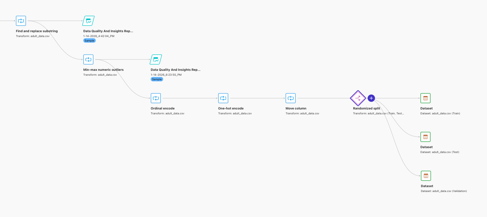

Your data is now properly split and ready for model training!

---

## Task 18: Export Train, Test, and Validation Datasets to S3

This is the final step! Now that we've cleaned, transformed, and split our data, we need to export all three datasets (Train, Test, and Validation) to S3 so they can be used for model training.

**Why export to S3?**

- S3 provides durable, scalable storage for your processed datasets
- Makes the data accessible to SageMaker training jobs
- Allows you to reuse the cleaned data for multiple experiments
- Keeps a permanent record of your data preparation work

### Steps to Export Datasets

We'll need to repeat these steps three times - once for each dataset (Train, Test, and Validation).

#### Export Train Dataset

1. **Go to the Data Flow tab**
   - Click on the "Data Flow" tab to see your data pipeline

2. **Select the Train dataset**
   - Click on the Train dataset icon in your flow

3. **Add export destination**
   - Click the "+" button
   - Click "Export"
   - Click "Add destination"

4. **Configure the export**
   - **Dataset Name**: **vijay_data_train**
   - **Amazon S3 Location**: Select your S3 bucket location
   - **Export Settings**: **Default**
   - **Partitioning**: **1**
   - Click "Add and Export"

5. **Configure the job**
   - Click on **"Advanced"**
   - Turn off **"Auto Job Configuration"**
   - **Job Name**: **vijay-data-train-job**
   - Click "Export"

#### Export Test Dataset

Repeat the same steps for the Test dataset:
- Dataset Name: **vijay_data_test**
- Job Name: **vijay-data-test-job**

#### Export Validation Dataset

Repeat the same steps for the Validation dataset:
- Dataset Name: **vijay_data_validation**
- Job Name: **vijay-data-validation-job**

### Monitor Export Jobs

All 3 job statuses can be found under:
**AWS SageMaker AI → Data Preparation → Processing Jobs**

You'll see all three jobs running or completed. Wait for all jobs to show "Completed" status before proceeding to model training.

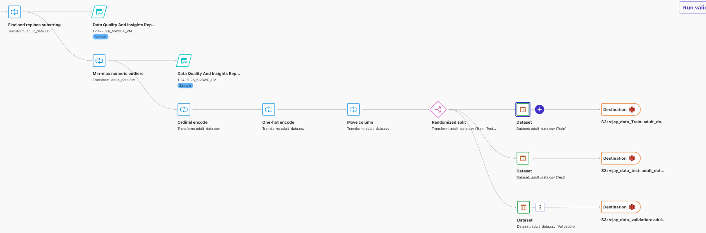

Congratulations! Your data is now fully prepared, cleaned, and exported to S3, ready for machine learning model training!

---

**What's Next?**

Now that your data is prepared and stored in S3, you can:
- Train machine learning models using SageMaker
- Experiment with different algorithms (XGBoost, Random Forest, etc.)
- Build and deploy prediction models
- Iterate on your data preparation if needed

Remember to log out of Canvas properly to avoid unnecessary charges!
